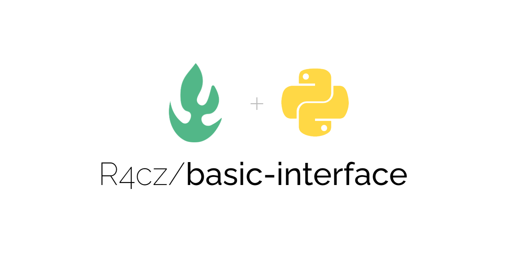
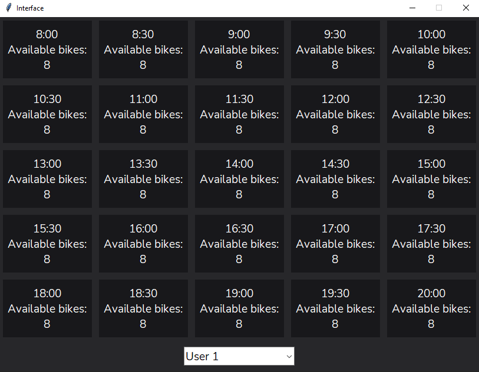
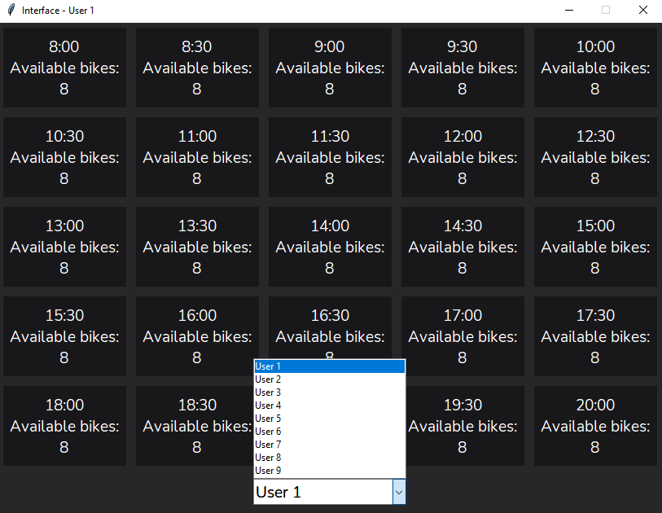
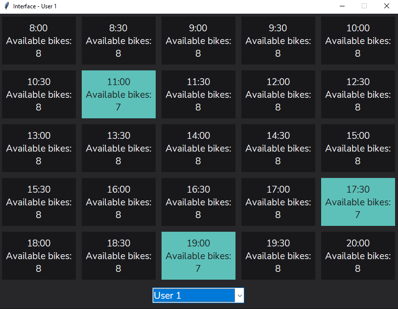
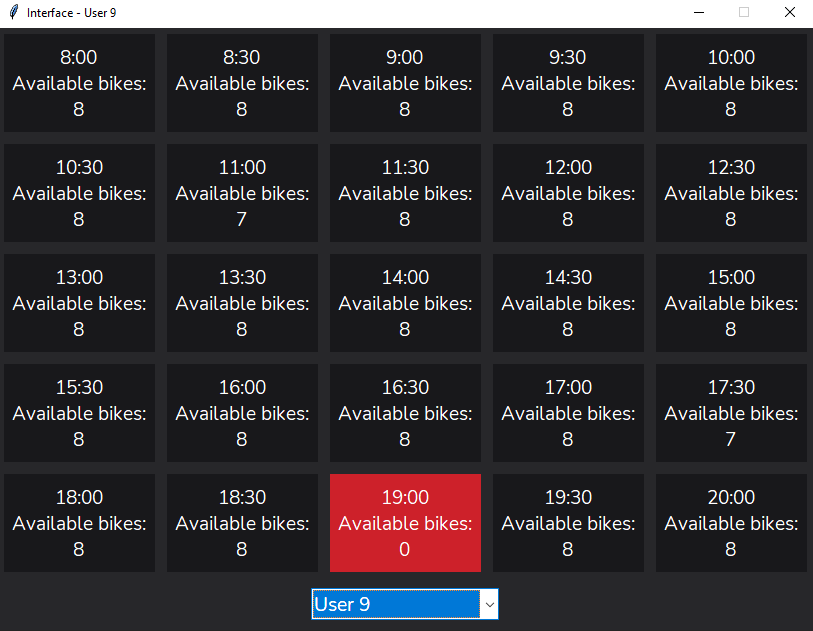

<h1 align="center" id="title">Basic Interface</h1>

<p align="center"></p>

<p id="description">Basic interface for an online reservation system using Object Oriented Programming.</p>

## Table of Contents

- [Demo](#demo)
- [Features](#features)
- [Installation Step](#installation-steps)
- [The process](#the-process)
  - [Built with](#built-with)
  - [Structure](#structure)
- [Useful resources](#useful-resources)
- [License](#license)
- [Author](#author)

## Demo





  
## Features

Here're some of the project's best features:

*   Demonstrating proficiency in Python.
*   Demonstrating proficiency in Object Oriented Programming.

## Installation Steps:

1. Clone the repository.
2. Open the project with Visual Studio Code.
3. Run the app and enjoy it.

## The process 
### Built with

Technologies used in the project:

*   Python 3.9
*   Visual Studio Code 1.70.2

### Structure

``` Python
    class User:
    
        def __init__(self, name):
            self.name = name
            self.take_list = []
            list = []
            for row in range( 0, 5):
                for column in range( 0, 5):
                    take = False
                    list.append(take)
                self.take_list.append(list)
                list = []

        def __str__(self):
            return self.name

        def user_take(self, fi , co, delivery):
            if self.take_list[fi][co] == False and delivery != 0:
                self.take_list[fi][co] = True
                return False
            elif self.take_list[fi][co] == True:
                self.take_list[fi][co] = False
                return True
```

## Useful resources

* [Python](https://www.python.org/) - High-level interpreted programming language whose philosophy emphasizes the readability of its code.
* [Visual Studio Code](https://code.visualstudio.com/) - Source code editor developed by Microsoft.

## License:

> This project is licensed under the MIT License

## Author

Made with 💚 by [R4cz](https://www.linkedin.com/in/r4cz/)
